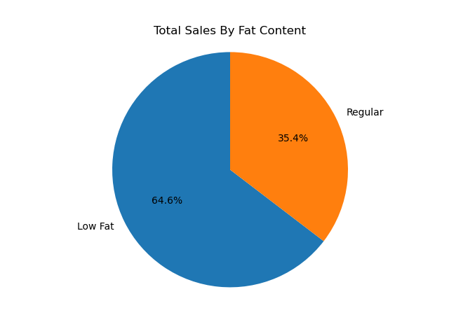
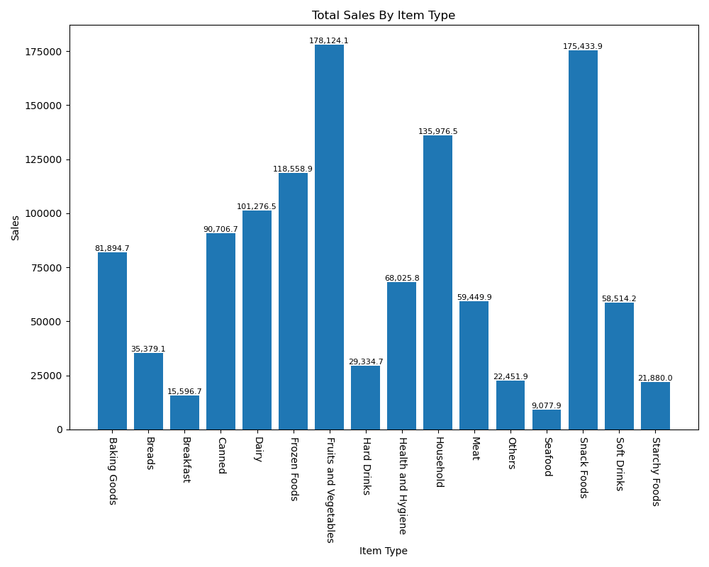
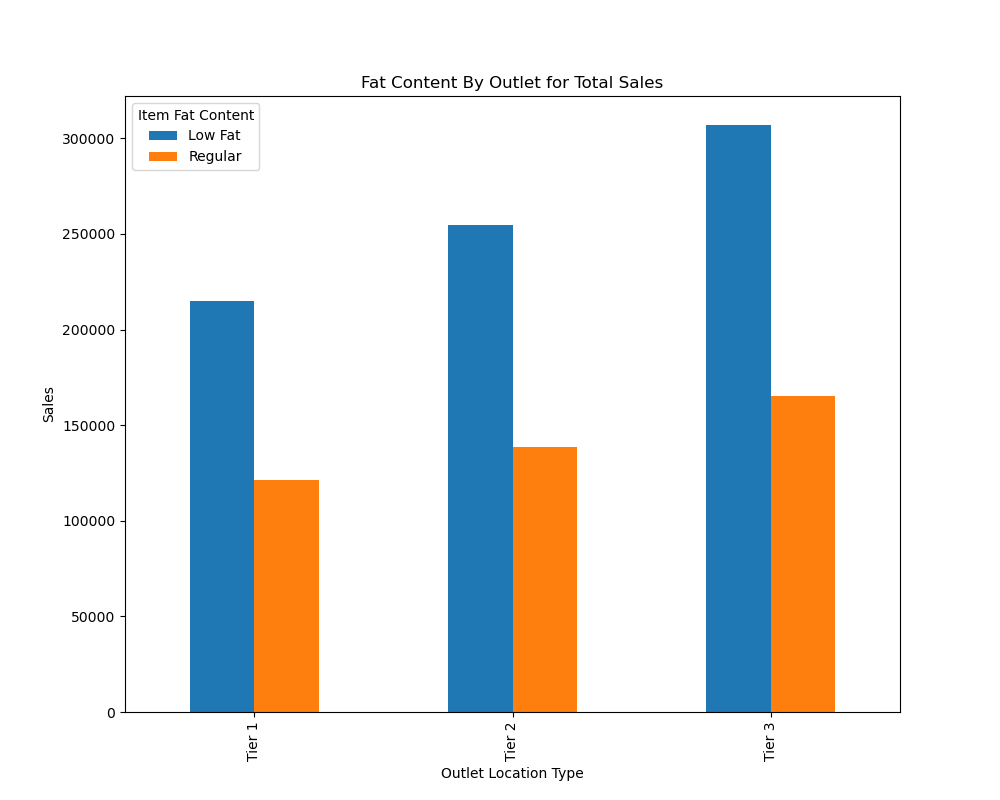
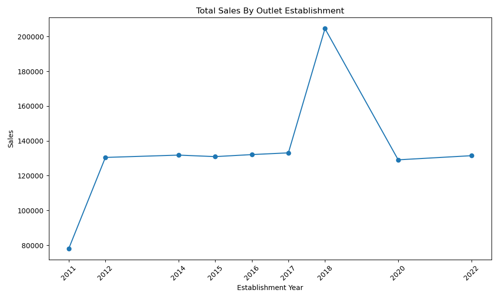
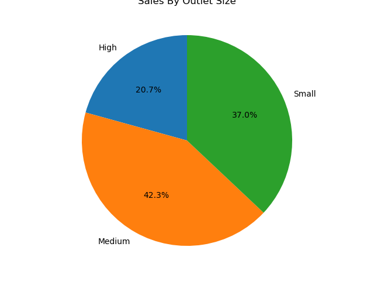
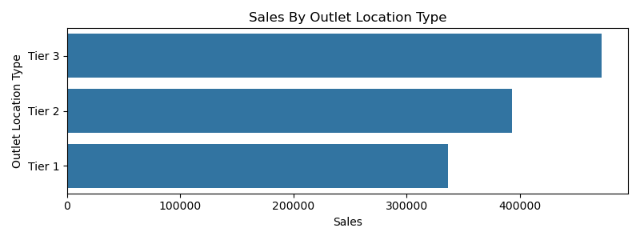

# blinkit-sales-analysis
Developed a Python-based project to analyze Blinkit's sample dataset by identifying key performance indicators (KPIs) and creating visual reports. Utilized Python, Pandas, and Matplotlib/Seaborn to process data, uncover trends, and present insights through interactive charts, aiding business decision-making.

## Tools Used : 
Python libraries : 
   - pandas
   - Matplotlib
   - seaborn

## Key Findings (KPIs)

   - **Total Sales:** 1,201,681.49 – Total revenue generated during the analyzed period.
   - **Average Sales:** 140.99 – Average sales per transaction/item.
   - **Number of Items Sold:** 8523 – Total items analyzed in the dataset.
   - **Average Ratings:** 3.99 – Mean customer rating across all items.

## Charts

### Total Sales by Fat Content

    - Shows the sales distribution between Low Fat and Regular items.

    - Insight: Majority of sales come from Low Fat items.

   

### Total Sales by Item Type

    - Compares sales across different product categories.

    - Helps identify the best-performing item types.

 
 

### Fat Content by Outlet for Total Sales

    - Displays sales contribution of different fat content categories across outlet locations.

### Total Sales by Outlet Establishment Year

    - Shows how outlet establishment years affect total sales.

    - Useful for identifying high-performing store age groups.

### Percentage of Sales by Outlet Size

    - showing sales share by outlet size (Small, Medium, Large).

### Sales by Outlet Location Type

    - highlighting sales performance by urban/rural/tier locations.

